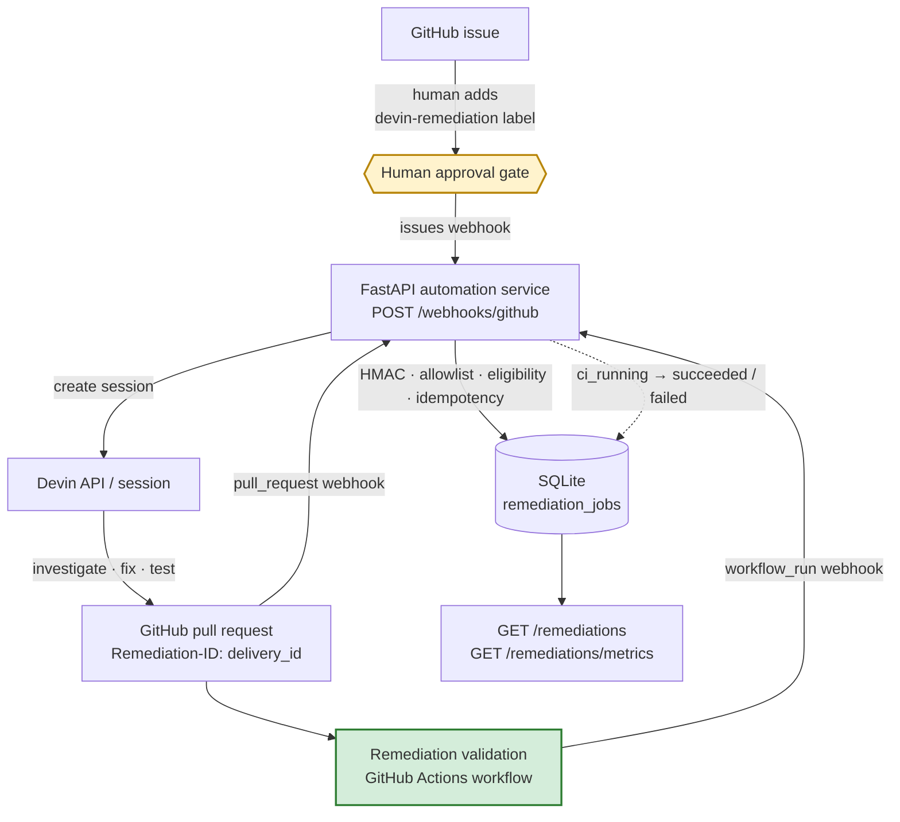

# devin-remediation-automation

A small FastAPI service that turns a labeled GitHub issue into a validated pull request, using
Devin as the engineer that does the remediation work.

## Overview

**Problem.** Routine remediation work — dependency lock drift, vulnerable transitive pins,
linter findings — is well specified but tedious, and it is never a single command: each ticket
needs someone to read the repo, decide the *smallest safe* change, run the right validation, and
write up the reasoning in a PR. That is exactly the work that stalls in backlogs.

**Workflow automated.** A human triages an issue and adds one label. From that point the system
dispatches a Devin session, correlates the PR Devin opens back to the originating issue, tracks the
repository's own CI on that PR, and exposes the full lifecycle over a read-only API. The human's
remaining job is code review and merge.

**Why Devin is the core primitive.** The fix is not prescribed. Each issue is ambiguous in
a way scripts cannot handle: "pin is vulnerable, find the smallest safe upgrade", "align a
constraint with the lock", "address Ruff findings without changing behavior". Devin investigates
the codebase, chooses the change, runs the repo's own tooling, and explains the root cause in the
PR. The service around it is deliberately thin — it provides the approval gate, idempotency,
state, and independent validation that make an autonomous engineer safe to run on a real repo.

## Real remediation results

Three real issues in the fork [`frances-devin-takehome/superset`](https://github.com/frances-devin-takehome/superset)
were remediated by Devin through this pipeline. All PRs are intentionally left open for review.

| Issue | Category | PR | Outcome |
| --- | --- | --- | --- |
| [#1 xlrd constraint/lock mismatch](https://github.com/frances-devin-takehome/superset/issues/1) | Dependency lock drift | [PR #2](https://github.com/frances-devin-takehome/superset/pull/2) | Root cause found (`xlrd` bound lived only in an extra that is not a compile input); one-line constraint added to `requirements/base.in`, lock regenerated, `xlrd 2.0.1 → 2.0.2` only. Predates PR correlation and CI tracking, so no `Remediation-ID`/validation status was recorded. |
| [#4 Ruff findings](https://github.com/frances-devin-takehome/superset/issues/4) | Code quality | [PR #5](https://github.com/frances-devin-takehome/superset/pull/5) | 39 findings under newer Ruff brought to zero across three Ruff versions with behavior-preserving edits; false positives suppressed with reasoning; formatter drift explicitly left out. Predates correlation/CI tracking; the current `Remediation validation` workflow does not yet cover this category. |
| [#6 vulnerable python-multipart pin](https://github.com/frances-devin-takehome/superset/issues/6) | Security dependency | [PR #7](https://github.com/frances-devin-takehome/superset/pull/7) | Transitive pin (via `mcp`/`fastmcp-slim`) bumped `0.0.29 → 0.0.32`, fixing four advisories (CVE-2026-53537..53540); scoped `--upgrade-package` recompile, one line changed. Carries `Remediation-ID`; [`Remediation validation` passed](https://github.com/frances-devin-takehome/superset/actions/runs/35534835834), which the service records as `succeeded`. |

Only the third issue exercised the complete lifecycle end to end; the first two were dispatched by earlier
revisions of the service, before the PR-correlation and CI-tracking stages existed.

## What the system does

1. A human adds the `devin-remediation` label to an issue in the allowed repository.
2. GitHub delivers an `issues` webhook to `POST /webhooks/github`.
3. The service verifies the `X-Hub-Signature-256` HMAC, checks the repository allowlist, checks
   eligibility (`action == labeled`, label exactly `devin-remediation`), and claims the
   `X-GitHub-Delivery` id in SQLite so redeliveries never create a second session.
4. It builds a task from the issue (title, URL, body/acceptance criteria) and creates one Devin
   session via the v3 Organization API. The task asks Devin to investigate, make the smallest
   appropriate fix, run the relevant validation, open a PR, and include
   `Remediation-ID: <delivery_id>` in the PR body.
5. Devin investigates, fixes, tests, and opens the PR against the same repository.
6. The `pull_request` (`opened`) webhook is read for the `Remediation-ID` marker and correlated
   back to the job → `pr_created`.
7. The repository's `Remediation validation` GitHub Actions workflow runs on the PR,
   independently of Devin.
8. `workflow_run` webhooks move the job to `ci_running`, then `succeeded` (conclusion `success`)
   or `failed` (any other conclusion).

## Architecture



Two things are deliberate: nothing is dispatched without the label (yellow), and the final
verdict comes from deterministic CI in the target repository, not from the agent's own report
(green).

## Remediation lifecycle

```
in_progress → dispatched → pr_created → ci_running → succeeded | failed
```

| status | meaning |
| --- | --- |
| `in_progress` | delivery claimed; Devin session creation is in flight |
| `dispatched` | a Devin session was created |
| `pr_created` | a PR carrying this job's `Remediation-ID` was opened |
| `ci_running` | `Remediation validation` is queued/running for that PR |
| `succeeded` | the validation workflow completed with conclusion `success` |
| `failed` | Devin session creation failed (retryable by redelivery), **or** validation completed with any non-success conclusion (terminal, never re-dispatched) |

**Only `succeeded` means independent validation passed.** `dispatched` means "handed to Devin";
`pr_created` means "Devin produced a PR". Neither is a claim that the fix is correct.

Rerun semantics: the latest *completed* workflow run wins, so a failed run followed by a
successful rerun ends `succeeded`, and vice versa. A queued/in-progress event never regresses a
completed result (`ci_running` is only applied when the job is not already `succeeded`/`failed`).

## Observability

| Endpoint | Purpose |
| --- | --- |
| `GET /remediations` | newest-first list; `?status=<lifecycle status>`, `?limit=` (1–200, default 50), `?offset=` |
| `GET /remediations/{delivery_id}` | one job, `404` if unknown |
| `GET /remediations/metrics` | aggregate counts and operational timestamps |
| `GET /health` | liveness |

A successful remediation (`GET /remediations/{delivery_id}`, abbreviated):

```json
{
  "delivery_id": "6abfc880-b52f-11f1-998e-e3d59f35295d",
  "repository": "frances-devin-takehome/superset",
  "issue_number": 6,
  "issue_title": "Remediate vulnerable python-multipart dependency pin",
  "status": "succeeded",
  "attempts": 1,
  "devin_session_id": "devin-…",
  "devin_session_url": "https://app.devin.ai/sessions/…",
  "pr_number": 7,
  "pr_url": "https://github.com/frances-devin-takehome/superset/pull/7",
  "ci_run_url": "https://github.com/frances-devin-takehome/superset/actions/runs/…",
  "ci_conclusion": "success",
  "ci_completed_at": "…"
}
```

Metrics shape:

```json
{
  "total": 6,
  "counts_by_status": {
    "in_progress": 1, "dispatched": 1, "pr_created": 1,
    "ci_running": 1, "succeeded": 1, "failed": 1
  },
  "dispatch": { "attempts": 7, "last_dispatched_at": "2026-09-19 13:40:02" },
  "oldest_in_progress_at": "2026-09-19 13:41:55"
}
```

- `counts_by_status` — **current state**: each job counted once, under its present status.
- `dispatch` — **historical**: `attempts` counts every Devin dispatch attempt including retries of
  failed ones, so it can exceed `total`.
- `oldest_in_progress_at` surfaces work stuck mid-dispatch.

## Running locally

**Prerequisites:** Docker (or Python 3.12 for a non-container run), a GitHub webhook secret, and
a Devin service-user API key with `ManageOrgSessions` plus the Devin organization id.

**Environment variables** (see `.env.example`; secrets are read from the environment only and are
never baked into the image):

| Variable | Required | Description |
| --- | --- | --- |
| `GITHUB_WEBHOOK_SECRET` | yes | Shared secret on the GitHub webhook; verifies `X-Hub-Signature-256`. |
| `DEVIN_API_KEY` | yes | Devin service-user API key (`ManageOrgSessions`). Sent as `Authorization: Bearer`. |
| `DEVIN_ORG_ID` | yes | Devin organization id used in the v3 API path. |
| `DEVIN_API_BASE_URL` | no | Defaults to `https://api.devin.ai`. |
| `ALLOWED_REPOSITORY` | no | `owner/name` allowed to dispatch. Defaults to `frances-devin-takehome/superset`. |
| `DELIVERY_DB_PATH` | no | SQLite file for job state. Defaults to `data/deliveries.db` (`/data/deliveries.db` in Docker). |

**Build:**

```bash
docker build -t devin-remediation-automation .
```

**Run** with a named volume so job state survives restarts:

```bash
docker run --rm -p 8000:8000 \
  -e GITHUB_WEBHOOK_SECRET=replace-me \
  -e DEVIN_API_KEY=replace-me \
  -e DEVIN_ORG_ID=replace-me \
  -v devin-remediation-data:/data \
  devin-remediation-automation
```

**Health check:**

```bash
curl http://localhost:8000/health
# {"status":"healthy"}
```

Interactive API docs: http://localhost:8000/docs.

Without Docker:

```bash
python3.12 -m venv .venv && source .venv/bin/activate
pip install -e ".[dev]"
export GITHUB_WEBHOOK_SECRET=… DEVIN_API_KEY=… DEVIN_ORG_ID=…
uvicorn devin_remediation_automation.main:app --reload --port 8000
pytest        # mocked Devin API; never creates real sessions
ruff check .
```

## Simulating / evaluating locally

There is no local webhook-simulation helper yet. The test suite (`tests/test_github_webhook.py`,
`tests/test_pull_request_correlation.py`, `tests/test_ci_tracking.py`) drives the endpoint with
signed synthetic `issues`, `pull_request`, and `workflow_run` payloads against a mocked Devin API,
and is currently the fastest way to see each stage exercised.

> TODO: a small script that signs and POSTs the three payload types at a running instance (with
> Devin dispatch stubbed) would be a useful evaluator convenience.

## Running a real E2E remediation

1. Run the service and expose it on a public URL (for the demo, a Cloudflare quick tunnel; any
   tunnel or deployed endpoint works).
2. In the target repository, add a webhook pointing at `<public-url>/webhooks/github` with
   content type `application/json`, the same secret as `GITHUB_WEBHOOK_SECRET`, and the events
   **Issues**, **Pull requests**, and **Workflow runs**.
3. Make sure the repository has a workflow named `Remediation validation` (the fork's runs the
   repo's own `uv-pip-compile.sh` and fails on lock drift).
4. Create or select an issue with clear acceptance criteria and add the `devin-remediation` label.
5. Observe: the webhook response returns `dispatched` with a session URL; `GET /remediations`
   shows the job move `dispatched → pr_created` when Devin's PR (with `Remediation-ID`) opens,
   then `ci_running → succeeded|failed` as the workflow completes.

## Safety / reliability properties

- **HMAC verification** — every event (not just `issues`) must carry a valid
  `X-Hub-Signature-256`; otherwise `401`.
- **Repository allowlist** — only `ALLOWED_REPOSITORY` can dispatch or update jobs.
- **Human approval label** — nothing happens until a person adds `devin-remediation`; other
  label/issue activity is ignored without calling Devin.
- **Idempotent delivery handling** — the claim is an `INSERT` on the `X-GitHub-Delivery` primary
  key, so exactly one of concurrent duplicates wins; redeliveries return `duplicate`/`in_progress`
  with the original session. A missing delivery header is rejected with `400`.
- **Persistent job state** — SQLite at `DELIVERY_DB_PATH`; older schemas are migrated on startup
  (`ALTER TABLE … ADD COLUMN`, and rows from the legacy `deliveries` table are imported with
  `INSERT OR IGNORE`).
- **PR correlation** — a `pull_request` event only *updates* an existing job matched by
  `Remediation-ID`; unrelated PRs are ignored with `200`; a job keeps its first PR.
- **Independent CI validation** — the verdict is the target repo's own workflow conclusion, not
  Devin's self-report. Session-creation failures return `502` and are never reported as dispatched.
- **Rerun semantics** — latest completed run wins; in-flight reruns never regress a final state;
  a validation `failed` is terminal and is not re-dispatched.

## Design decisions

- **Label-triggered, not fully automatic.** A human decides which issues are safe to hand off;
  the label is the audit trail of that decision, and it keeps the blast radius to opted-in issues.
- **Devin for ambiguous remediation.** "Smallest safe fix" requires reading the repo, choosing
  among options (constraint vs. extra, pin vs. upgrade), running repo tooling, and explaining the
  choice. The three PRs above show exactly that reasoning; none of it is scriptable.
- **Deterministic CI validates the agent.** The agent's claims are inputs to review, not proof.
  The repository's own recompile check decides `succeeded`, so a plausible-but-wrong PR fails
  loudly.
- **SQLite.** One process, low volume, and the value is durability across restarts plus atomic
  claims on a primary key — SQLite provides both with zero infrastructure for a take-home.
- **Cloudflare quick tunnel is demo ingress only.** It gives GitHub a reachable URL during a demo;
  nothing in the code depends on it, and it is not a production ingress design.

## Production evolution / limitations

- **Queue + background workers** — dispatch currently happens inline in the webhook request; a
  queue would decouple GitHub's delivery timeout from Devin API latency and allow retries with
  backoff.
- **Durable database** — replace SQLite with Postgres for multi-replica deployments and proper
  migrations.
- **Secret manager** — env vars are fine for a container demo; production should pull from a
  secret store and rotate.
- **Stable ingress** — a deployed endpoint with TLS termination and IP allowlisting for GitHub's
  webhook ranges instead of a tunnel.
- **Concurrency / rate limits** — cap in-flight sessions per repo/org and respect Devin API limits.
- **Session/cost tracking** — poll or subscribe to session status, record duration and ACU usage
  per remediation, and expose it in `/remediations/metrics`.
- **Richer CI/test-category routing** — `Remediation validation` currently covers only the
  Python-dependency category (path-filtered recompile check). Code-quality and other categories
  need their own jobs so every remediation type gets an independent verdict. The workflow also
  does not install or run the resolved dependencies, so runtime breakage from a bump is not
  detected.
- **PR lifecycle beyond `opened`** — closed/merged PRs and follow-up commits are not tracked.

## Layout

```
src/devin_remediation_automation/
    main.py                 # FastAPI app factory
    config.py               # environment-backed settings
    security.py             # GitHub webhook HMAC verification
    remediation.py          # task prompt, Remediation-ID marker, workflow-name constants
    devin_client.py         # Devin v3 Organization API client
    remediation_store.py    # SQLite job store: claims, correlation, CI outcomes, metrics
    dependencies.py         # FastAPI providers for HTTP, Devin, and store clients
    api/webhooks.py         # POST /webhooks/github (issues, pull_request, workflow_run)
    api/remediations.py     # GET /remediations, /remediations/{id}, /remediations/metrics
    api/health.py           # GET /health
tests/                      # pytest; Devin API mocked
```
